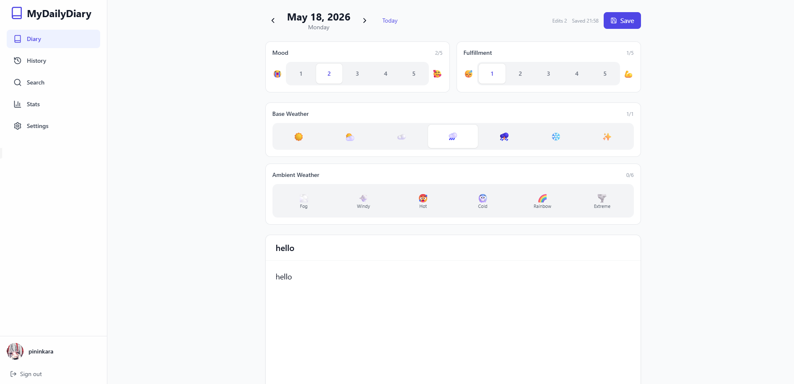
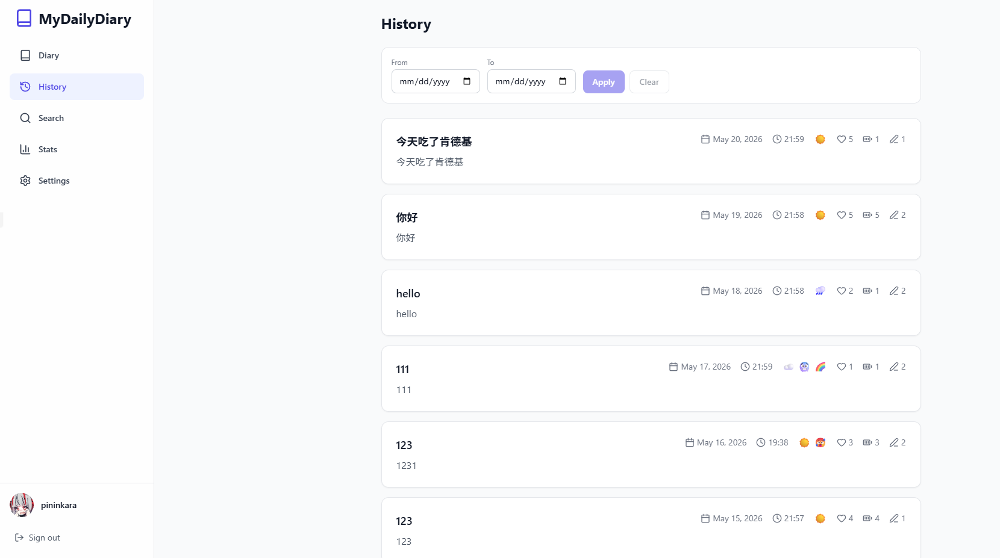
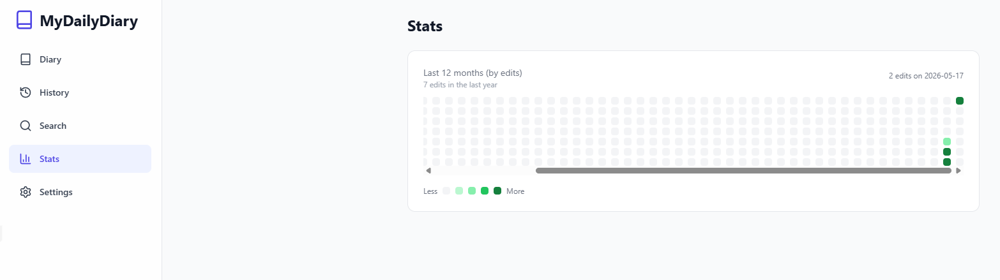
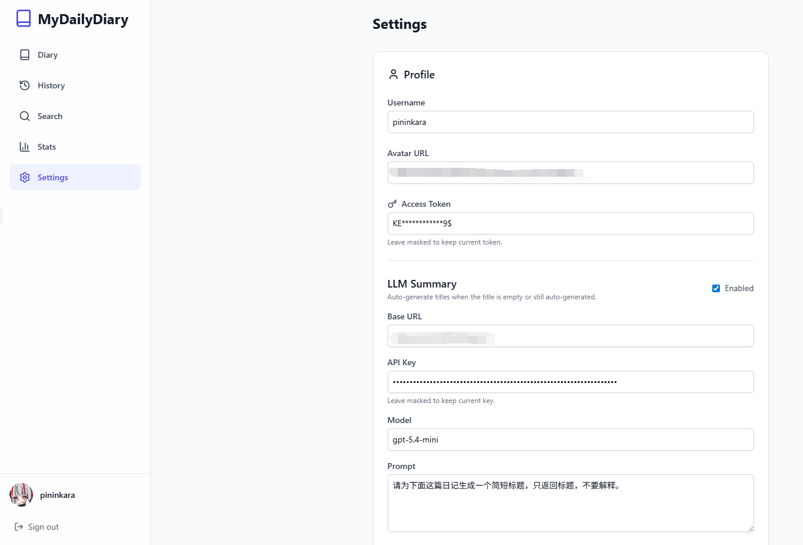

# MDD-MyDailyDiary

Chinese version: [README.zh.md](README.zh.md)

MDD-MyDailyDiary is a self-hosted online journal built with a Go backend and a React frontend. It is designed for people who want to keep their writing private, keep their data under their own control, and edit from any device without depending on a third-party platform.

🤖Vibe coding disclosure: more than 90% of the code in this project was generated with AI assistance. I performed limited testing to confirm that the app is usable, but I do not guarantee that it is free of bugs.

## Overview
This is a personal journaling app focused on three things: long-term storage, fast daily writing, and easy review. It is not a social platform. It is a lightweight and private data tool that lets you write entries by date, capture standalone thoughts, search past records, review history, and keep everything inside your own SQLite database.

The app uses a decoupled single-page architecture. The frontend handles diary and thought editing, browsing, search, and settings. The backend handles authentication, persistence, import/export, and optional LLM-powered title generation. The overall design intentionally stays simple: clear UI, clear APIs, and a deployment model that avoids unnecessary external dependencies.

If you want a private journal layer for your personal knowledge base, an emotional tracking tool, or a long-lived self-owned note archive, this project is built for that.

Main view:



History view:



Stats view:



Settings view:



## Why This Project
The original goal was simple: build a journal system that truly belongs to the user. Data stays on your own server or device, and once you log in, you can keep writing from any device without handing your content over to a social platform or cloud note service.

This project is meant to be enough, stable, and maintainable over time rather than overloaded with features. Journal entries are written for yourself, so it does not try to support Markdown, images, videos, embedded locations, or other rich insertion features. Because it is designed for a single-user personal scenario, it also does not include multi-user collaboration, comments, sharing, or social relationships.

It focuses on the record itself: what happened today, how you felt, what the environment was like, whether something got done, and whether you can quickly find the answer later when you come back to review it. That is why the app keeps the interaction and data model intentionally lightweight, so it can remain self-hosted, portable, and under your control for a long time.

The database is intentionally kept unencrypted at the application layer. This project is not trying to defend against a complex shared environment; it is trying to keep search, import/export, and migration simple and reliable. If the content were encrypted inside the app, search performance, statistics, and data exchange would become much more complicated and the product would move away from its original goal of being simple, controllable, and sustainable. For this use case, the security boundary is better handled by your self-hosted environment and system-level encryption.

## Architecture
- **Backend**: Go 1.25 + SQLite (JSON API)
- **Frontend**: React + Vite + TailwindCSS (SPA)

## Features
- **Private deployment**: Keep data in your own environment and run it locally, on a server, or in Docker
- **Quick daily entry**: Write by date and save changes manually when needed
- **Standalone thoughts**: Capture title-free, body-only notes in a separate SQLite table; thoughts remain independent from diary entries and do not affect diary statistics
- **Minimal writing surface**: No Markdown, no images, no videos, no complex rich-text editor, just a clean writing flow
- **Mood and context tracking**: Record mood, fulfillment, base weather, and ambient weather to capture the context of each day
  - Mood and Fulfillment sliders track your emotional state for the day. Higher Mood means a happier day, higher Fulfillment means a busier and more fulfilling day.
  - Base weather slider records the primary weather conditions for the day.
  - Ambient weather tracks secondary weather conditions, presented as a multi-select list rather than a slider.
- **Calendar-style review**: Jump back to any day through the calendar and history views
- **Continuous browsing**: History, search results, and thoughts automatically load the next page as you approach the bottom
- **Expandable entries**: Expand or collapse long diary content directly in history and search results
- **Full-text search**: Find old entries by content, date, and other filters quickly
- **Stats page**: See entry trends and summaries over time
- **LLM summaries**: Optionally generate entry titles automatically to make long entries easier to scan. When disabled, the first few characters of the entry text serve as the default title
- **Import and export**: Back up and migrate diary entries and thoughts together through JSON import/export
- **Basic personalization**: Set your username, avatar, and theme appearance

## Getting Started

### 1. Local development

You need Go and Node.js installed.

**Install frontend dependencies**:
```bash
cd frontend
npm install
```

**Start the frontend dev server**:
```bash
cd frontend
npm run dev
```

**Start the backend**:
```bash
cd ..

# PowerShell
$env:DIARY_LOGIN_TOKEN="your-token"
go run ./cmd/diary
```

If you want to simulate production static assets, build the frontend first and then start the backend:

```bash
cd frontend
npm run build
cd ..

go run ./cmd/diary
```

Open: http://localhost:8080

### 2. Docker deployment

**Build the image**:
```bash
docker build -t diary-app .
```

**Run the container**:
Mount the `data` directory to persist the database and configuration.

```bash
# 1. Create the data directory
mkdir data
# Copy the example config (optional)
cp config.sample.toml data/config.toml

# 2. Start the container
docker run -d -p 8080:8080 -v ${PWD}/data:/app/data --name diary diary-app
```

Open: http://localhost:8080

## Configuration
Configuration file `config.toml` or environment variables:
- `auth.token`: Login token
- `server.address`: Server listen address, default `:8080`
- `database.path`: SQLite database path
- `llm.enabled`: Enable LLM title summaries
- `llm.base_url`: OpenAI-compatible API base URL; the app calls `/v1/responses` (a trailing `/v1` is also accepted)
- `llm.api_key`: LLM API key
- `llm.model`: LLM model name
- `llm.prompt`: Prompt used for title generation

## Project Layout
```
.
├─ cmd/
│  └─ diary/
│     └─ main.go          # Program entrypoint
├─ internal/
│  └─ app/
│     ├─ config.go        # Config loading and saving
│     ├─ db.go            # Database, migration, queries
│     ├─ handlers.go      # HTTP handlers
│     ├─ helpers.go       # Shared helper functions
│     ├─ http.go          # Middleware and HTTP helpers
│     ├─ llm.go           # LLM title generation logic
│     ├─ server.go        # App startup and route registration
│     ├─ thoughts.go      # Standalone thoughts API and pagination
│     └─ types.go         # Core type definitions
├─ Dockerfile             # Multi-stage build file
├─ frontend/              # React frontend project
│  ├─ src/
│  ├─ dist/               # Compiled static assets
│  └─ ...
├─ data/                  # SQLite data and runtime config
├─ config.sample.toml     # Example config
├─ go.mod
└─ go.sum
```
